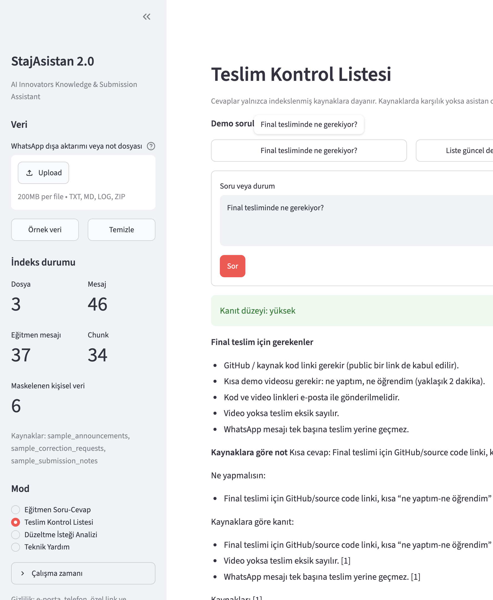

# StajAsistan 2.0 — AI Innovators Knowledge & Submission Assistant

A privacy-aware, citation-grounded **local RAG application** built on **Microsoft Foundry Local**,
for the Microsoft AI Innovators Summer Internship program.

Project track: *Building Your First Local RAG Application with Foundry Local*.

Everything runs on your machine. No document, no message and no question ever leaves it.

---

## Problem

Program information is scattered across three WhatsApp groups, e-mails, meeting recordings and a
roster page. The same questions get asked every week, by different people, in different groups:

- What exactly do I have to submit at the end?
- Does the video count if it is already inside my GitHub repo?
- Is one certificate issued per person or per project?
- The roster still shows my old project — should I stop working until it is fixed?
- How do I request a correction, and is a WhatsApp message enough?

Answers do exist — they are buried in 2,100+ messages, spread over three months, and often given
as two-word replies to someone else's question. Meanwhile the same chat history contains the
participants' names, e-mail addresses and phone numbers, so it cannot simply be pasted into a
cloud chatbot.

## Solution

StajAsistan ingests those exports locally, strips personal data during ingestion, indexes the
result with real embeddings, and answers questions **only** from what it actually retrieved —
showing the source snippet behind every answer, and refusing to answer when the sources do not
cover the question.

It runs in four modes:

| Mode | What it does |
| --- | --- |
| **Instructor Q&A** | Answers program questions, weighting instructor announcements above group chatter |
| **Submission Checklist** | Reads your status in free text and reports what is ready, what is missing, and what to do next |
| **Correction Request Analyzer** | Structures a roster-correction request, flags missing identity info, and drafts an e-mail — it never edits anything itself |
| **Technical Help** | Foundry Local, local model, Python and GitHub questions, grounded in the same sources |

Answers are in Turkish, because the participants are.

## Why local RAG?

The input data is exactly the kind you should not upload: real names, e-mail addresses, phone
numbers, private Teams and OneDrive links, and a roster of 500+ participants that the instructor
pasted into the group. A local pipeline turns that from a compliance problem into a design
constraint: the raw export stays on disk, masking happens before indexing, and the model that
reads the context is running on the same laptop.

It is also simply the right tool here. The corpus is small, static and personal — a use case where
a small local model plus good retrieval beats a large remote one that cannot legally see the data.

## Why Foundry Local?

- It exposes an **OpenAI-compatible endpoint**, so the application code is standard and portable.
- It runs **disconnected**, which is the whole point of this project.
- It picks the right hardware variant (CPU/GPU/NPU) for the machine it is on.
- Small models are enough for grounded summarisation over retrieved snippets, which is all the
  generation step has to do here.

The application never assumes Foundry Local is running. If it is not, retrieval still works and
generation degrades to an **extractive mode** that can only quote retrieved sentences verbatim —
lower fluency, but hallucination becomes structurally impossible.

---

## Architecture

```text
WhatsApp .zip / _chat.txt / notes
              │
              ▼
   ingestion.py ── reads text entries only (images in the archive are never opened)
              │
              ▼
 whatsapp_parser.py ── iOS + Android formats, multiline messages, bidi cleanup,
              │        instructor alias detection, system-event removal
              ▼
     privacy.py ── e-mails, phones, private links, roster tables, @handles masked;
              │    participant names replaced by stable pseudonyms
              ▼
    chunking.py ── long announcements split with overlap;
              │    short messages grouped into conversation windows
              ▼
  embeddings.py ── Foundry Local → sentence-transformers → hashing (documented fallback chain)
              │
              ▼
 vector_store.py ── NumPy exact cosine (default) or ChromaDB
              │
              ▼
   retriever.py ── dense + BM25 hybrid, instructor authority weighting,
              │    recency decay, MMR de-duplication, refusal threshold
              ▼
   workflows.py ── deterministic checklist and correction analysis
              │
              ▼
  generation.py ── Foundry Local chat completions, or extractive fallback
              │
              ▼
    pipeline.py ── grounding contract: no sources ⇒ no model call ⇒ explicit refusal
              │
              ▼
        app.py  ── Streamlit UI with citations and evidence level
```

See [`docs/architecture.md`](docs/architecture.md) for the retrieval scoring details and the
measurements behind every threshold.

## Features

- **Real embedding-based retrieval**, not keyword matching, with a lexical BM25 component on top
  because program vocabulary ("sertifika", "teslim", "video") benefits from exact matching.
- **Instructor authority weighting.** A participant guessing "I don't think there are certificates"
  will not outrank the instructor's actual answer, even when it matches the question more literally.
  This is verified by a test.
- **Refusal instead of invention.** If nothing clears the calibrated threshold, the language model
  is never called; the assistant says the sources do not cover it.
- **Citations on every answer**, with the retrieved snippet, the authority level, the date, and a
  breakdown of why that chunk was retrieved.
- **Evidence level** (high / medium / low / none) shown next to each answer.
- **Deterministic workflows.** The checklist and the correction analyzer are rule-based, so their
  output does not change between runs; the model may only rephrase them.
- **Duplicate suppression.** The instructor reposted the same announcement roughly every two weeks;
  MMR keeps one copy instead of filling the context window with six.
- **Privacy by construction** — see below.

## Privacy design

The rule is simple: **raw exports never leave the machine, and personal data never reaches the
index.** Masking happens during ingestion, so every downstream artifact — chunks, embeddings,
prompts, citations, the on-screen output — is already sanitised.

| Removed | Replaced with |
| --- | --- |
| Personal e-mail addresses | `[E-POSTA]` |
| Organisational contact addresses | `[EĞİTMEN E-POSTA]` |
| Phone numbers (incl. bidi-wrapped WhatsApp senders) | `[TELEFON]` |
| Teams / OneDrive / WhatsApp-invite / roster links | `[ÖZEL LİNK]` |
| `Name <TAB> E-mail` roster tables | `[KATILIMCI LİSTESİ GİZLENDİ]` |
| `@handle` mentions | `[KULLANICI]` |
| Participant display names | `Katılımcı#a3f2` (stable, non-reversible) |

Public documentation links (`learn.microsoft.com`, `github.com`) are deliberately preserved,
because they are not personal data and removing them would make answers less useful.

Cohort-specific values are configuration rather than code, so the repository never names the
resources it protects:

```bash
export STAJ_ASISTAN_PRIVATE_HOSTS="liste.example.net"        # extra hosts to always mask
export STAJ_ASISTAN_INSTRUCTOR_ALIASES="ad soyad,ad soyad kurum"
```

Repository hygiene:

- `data/private/` and `data/raw/` are git-ignored, along with `*.zip`, `*_chat.txt` and all media
  extensions, so a raw export cannot be committed by accident.
- Only `data/samples/` is committed, and it is anonymised sample data.
- A test asserts the committed samples contain no real e-mail addresses, phone numbers or private
  links, so this cannot silently regress.
- Images are ignored everywhere except `screenshots/`, which may only hold captures of the app
  running on sample data — a chat screenshot would leak the very data the pipeline strips.

**Verified on the real corpus:** three exports, 2,108 messages after cleanup (543 from the
instructor), **3,215 personal data items masked, zero leaks** — no e-mail address, phone number or
raw sender name survived into the index.

| Masked | Count |
| --- | --- |
| Roster rows | 1,464 |
| Private links | 601 |
| Participant names pseudonymised | 523 |
| `@handle` mentions | 389 |
| Personal e-mail addresses | 104 |
| Phone numbers | 78 |
| Organisational addresses | 53 |
| Shared contact cards | 3 |

Full details and residual risks: [`docs/privacy.md`](docs/privacy.md).

---

## Setup

Requires Python 3.11+.

```bash
git clone <repo-url>
cd staj-asistan-foundry-local

python3 -m venv .venv
source .venv/bin/activate          # Windows: .venv\Scripts\activate

pip install -e ".[ui,embeddings,dev]"
```

### Foundry Local (recommended)

```bash
# https://learn.microsoft.com/azure/ai-foundry/foundry-local/
winget install Microsoft.FoundryLocal        # Windows
brew install microsoft/foundrylocal/foundrylocal   # macOS

foundry service start
foundry model run phi-4-mini
```

The application discovers the endpoint automatically. To point it somewhere else:

```bash
export FOUNDRY_LOCAL_ENDPOINT="http://localhost:5273/v1"
export FOUNDRY_LOCAL_MODEL="phi-4-mini"
```

### Embedding backend

Resolved in this order, and the active one is always shown in the sidebar:

1. **`foundry`** — Foundry Local `/v1/embeddings`, if an embedding model is loaded
2. **`sentence-transformers`** — `paraphrase-multilingual-MiniLM-L12-v2`, local and offline after
   first download; **this is the recommended configuration** for retrieval quality on Turkish text
3. **`hashing`** — dependency-free deterministic vectoriser used for tests, CI and cold start

Override with `STAJ_ASISTAN_EMBEDDING_BACKEND=foundry|sentence-transformers|hashing|auto`.
Set `STAJ_ASISTAN_OFFLINE=1` to force the fully offline path.

## Run

```bash
streamlit run app.py
```

Then either press **Örnek veri** to index the anonymised samples, or upload your own WhatsApp
export (`.zip` works directly — only text entries inside it are read).

There is also a CLI:

```bash
staj-asistan ask "Final tesliminde ne gerekiyor?"
staj-asistan ask "GitHub repo hazır ama video çekmedim" --mode submission_checklist
staj-asistan ask "Listede projem yanlış" --mode correction_analyzer --json
staj-asistan stats
```

## Test

```bash
pytest                    # 203 passed, 18 skipped, ~1 second, fully offline
```

Tests that load a real embedding model are opt-in, so the default run stays fast:

```bash
STAJ_ASISTAN_RUN_MODEL_TESTS=1 STAJ_ASISTAN_EMBEDDING_BACKEND=sentence-transformers pytest
```

What is covered:

| Area | Examples |
| --- | --- |
| WhatsApp parsing | multiline messages, six date formats, instructor alias variants, system-event removal |
| Privacy | every masking rule, pseudonym stability, policy toggles, sample-data hygiene |
| Chunking | metadata survival, overlap on long announcements, conversation windows |
| Retrieval | correct source retrieved, instructor beats participant guess, refusal path, MMR, persistence |
| Workflows | Turkish negation handling, checklist completeness, correction schema, identity gaps |
| Pipeline | the four demo scenarios end-to-end, no-sources-no-model-call contract, invalid citation stripping |

## Demo questions

1. *Final tesliminde ne gerekiyor?*
2. *Liste güncel değilse çalışmaya devam etmeli miyim?*
3. *GitHub repo hazır ama video çekmedim, teslim için eksiğim var mı?*
4. *Listede projem yanlış görünüyor, Foundry Local olarak güncellenmesini istiyorum. Bu mesaj yeterli mi?*

Walkthrough with expected behaviour: [`docs/demo_script.md`](docs/demo_script.md).

## Screenshots



This capture is the app answering *Final tesliminde ne gerekiyor?* after **Örnek veri** was loaded.
It uses only the anonymised files in `data/samples/`; no real WhatsApp export, name, e-mail or
local path is visible.

`screenshots/` is the only directory in this repository that may contain images, and only under
one condition: the capture must show this application running on the anonymised sample data.

Do not commit a screenshot of a chat window, a desktop, an editor, or anything showing the real
corpus — a single such image undoes the masking the rest of the pipeline performs. Reproduce the
images by pressing **Örnek veri** and running the four demo questions above.

## Limitations

Stated plainly, because knowing where a system is weak is part of shipping it:

- **The offline `hashing` backend has weak semantic refusal.** On an evaluation set of 12 in-scope
  and 9 out-of-scope questions, the sentence-transformers backend answered 12/12 and refused 9/9.
  The hashing fallback also answered 12/12 but wrongly accepted 5 of the 9 off-topic questions,
  because bag-of-words vectors cannot tell that "Mars'a ne zaman insan gönderilecek?" is unrelated
  when it shares the stems *zaman* and *gönder* with the corpus. Use a real embedding backend for
  anything beyond tests.
- **No Turkish named-entity recognition.** Masking handles structured identifiers (e-mails, phones,
  links, roster tables) reliably, but a name written in the middle of free-form prose can survive.
- **Stemming is fixed-length truncation**, a strong Turkish baseline but not a real morphological
  analyser; it occasionally conflates unrelated words that share a five-character prefix.
- **Single-turn.** There is no conversation memory, so follow-up questions must be self-contained.
- **Instructor recognition is cohort configuration.** Sample data uses the generic sender
  ``Eğitmen``. A real export needs ``STAJ_ASISTAN_INSTRUCTOR_ALIASES`` set locally; those names
  are not stored in this repository.
- **Retrieval thresholds are calibrated on this corpus** and would need re-measuring on a very
  different one.

## Future work

- Foundry Local embedding model as the primary path once one is available in the catalog, removing
  the sentence-transformers dependency entirely.
- A small Turkish NER pass to catch names in free-form prose.
- Cross-encoder reranking of the top candidates.
- Conversational memory with query rewriting for follow-up questions.
- An evaluation harness with a labelled question set, so retrieval changes can be measured rather
  than eyeballed.

## What I learned

- **Boosts must scale relevance, not add to it.** My first authority weighting added a constant to
  instructor chunks, which quietly broke the refusal path: an irrelevant instructor message scored
  above the threshold for *any* question. A test for an out-of-scope question caught it.
- **Retrieval quality is mostly a data-shape problem.** Grouping short replies with the question
  they answer mattered more than any scoring change, because the instructor's most important
  answers are two words long.
- **The embedding backend decides what your thresholds mean.** A single similarity cut-off shared
  across backends is meaningless; calibrating per backend, from measurements, is not optional.
- **Privacy is easier as an ingestion-time invariant** than as a display-time filter. Masking once,
  before indexing, means no later code path can leak.
- **The test fixtures were the leak, not the data pipeline.** A pre-push audit that cross-checked
  every e-mail, link, handle and digit sequence in the repository against the raw exports found
  eleven values I had pasted from real chats into test files while debugging — including a live
  WhatsApp group invite link, a real OneDrive share, and the password to the roster page. The
  masking pipeline was clean the whole time; the tests that verified it were not. Sanitising the
  output is not the same as sanitising the workbench.
- **Pointing a guard at my own committed files found two real bugs.** The test that scans
  `data/samples/` for personal data failed immediately: the phone matcher was reading chat
  timestamps like `[17.06.2026 16:13]` as phone numbers, which meant a message containing a
  deadline would have had that date replaced with `[TELEFON]`. The same trail showed the sidebar's
  "masked items" counter was computed over the raw file rather than the text actually masked, so it
  was inflated by more than 2,000 timestamps. Both are fixed and both now have tests.
- **Writing the refusal path first changed the design.** Deciding that "no evidence" must skip the
  model entirely made the grounding guarantee structural instead of a polite request in a prompt.

---

Built for the Microsoft AI Innovators Summer Internship, 2026.
